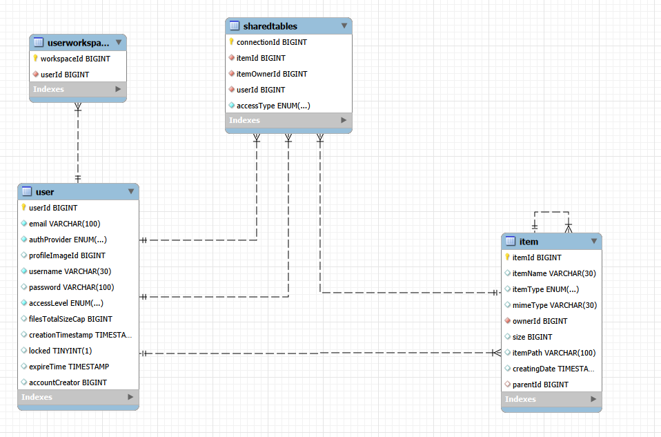

# What it does:
It hosts a web application that let you (and your family/friend) share files/backup for "FREE".
* You can share files with other people.
* Make admins to handle users.
* You can set per user a total amount of storage.


# How to set up:
* Install MySQL.    
  * Create a user called `fileZ` and set your password.
    * `CREATE USER 'fileZ'@'localhost' IDENTIFIED BY 'your_password';`
  * Create a database called `filez`.
    * `CREATE DATABASE filez;`
  * Grant all permissions to the `fileZ` to the database `filez`.
    * `GRANT ALL PRIVILEGES ON filez.* TO 'fileZ'@'localhost';`
* Create an `.evn.properties` on the root of the project.
  * Use this template:
```properties
# Google Login
spring.security.oauth2.client.registration.google.client-id=<your google client id>
spring.security.oauth2.client.registration.google.client-secret=<your google secret>

# Database
spring.datasource.url=jdbc:mysql://localhost:3306/filez
spring.datasource.username=fileZ
spring.datasource.password=<your mysql password>

# File size limits
spring.servlet.multipart.max-file-size=1GB
spring.servlet.multipart.max-request-size=10GB
```

# How to limit storage and file types:
The config of these values inside the code, the default is not block any file types.
But you can change that.
* Goto: `src/main/java/dev/right/filez/services/FileUploaderService.java`:
  * And on the first variables you can set up the allowed mime type with the allowed extensions allowed.
> [!IMPORTANT]
> That if the set size is equal or less as 1, it will allow all types.  
* Use application.properties to limit how much data per upload.

# Database
> [!NOTE]
> How files are stored is different how they are stored in the database.
> Files are stored like this: `uploadyear/uploadmonth/uploadday/randomUUID.ext`




Made by [MrRight](https://github.com/Mr-Right-Dev/FileZ).